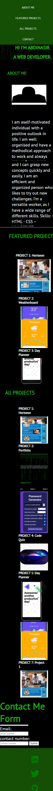
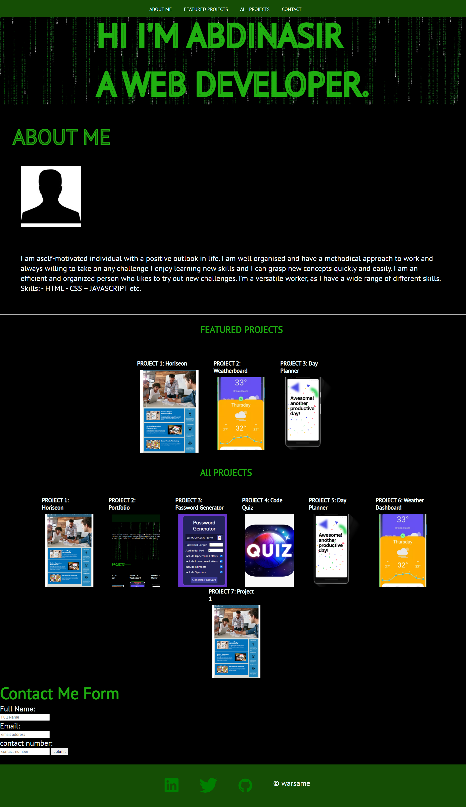

# my-portfolio

## what i was tasked to do:

- to create a responsive flexbox
- to make my portfolio responsive with media queries
- export css variable colors
- that the nav links should direct to relevant section using anchor tags.
- that the first project card should be larger than the rest
- the project card images should be able to open in new tab and be clickable.

## My projects:

- Horiseon (Marketing Agency Refactor)
- Personal Portfolio
- Password Generator
- Code Quiz
- Day Planner
- Weather Dashboard
- Project 1

## pieces of the portolio:

- My name
- A photo
- Nav links

  - About Me
    - Name
    - Personal statement
    - Image
    - Skills
  - My Projects
    - Project card should have an clickable image to deployed app, a title, brief description , a github icon which directs to the project repo
  - Contact Me

## My links

-github url: [https://github.com/abdinasir1993/my-portfolio](https://github.com/abdinasir1993/my-portfolio)

-deployed url:[https://abdinasir1993.github.io/my-portfolio/](https://abdinasir1993.github.io/my-portfolio/)

## Screenshots

### mobile Viewports

### desktop Viewports

